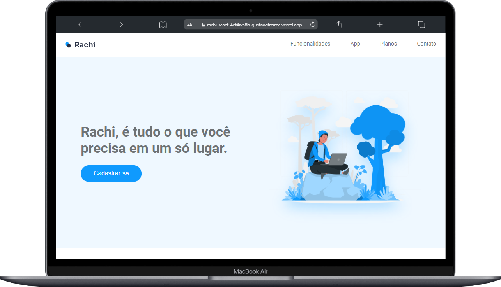
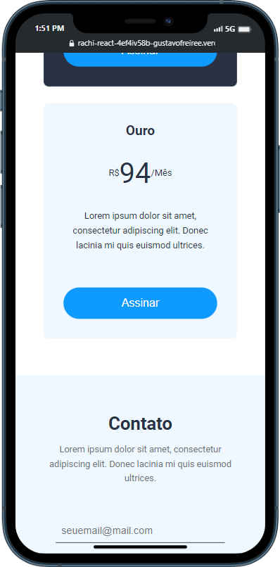

# React lorem

  

    
🖥️ Desktop

    
  

  

    
📱 Mobile

    
  

## You can access it remotely in the following link:

https://rachi-react.vercel.app/

# EN

## How to use

> -    <b>Clone this repo in your wished folder</b>

        Ex:
            git clone <this-repo-link>

> -    <b>Install all the dependencies</b>

        Ex:
            npm install

> -    <b>Initialize the project</b>

        Ex:
            npm run dev

> -    <b>Open the localhost on your browser and enjoy 😎</b>

# Pt-br

## Como usar

> -    <b>Clone este repositório na pasta desejada</b>

        Ex:
            git clone <this-repo-link>

> -    <b>Instale as dependências</b>

        Ex:
            npm install

> -    <b>Inicialize o repositório</b>

        Ex:
            npm run dev

> -    <b>Abra o localhost no seu navegador e aproveite 😎</b>
